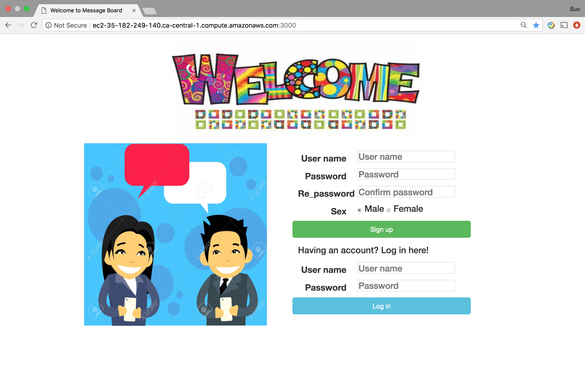
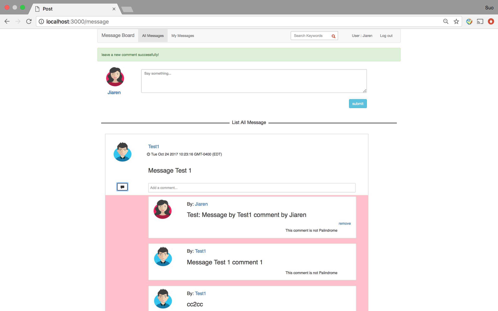
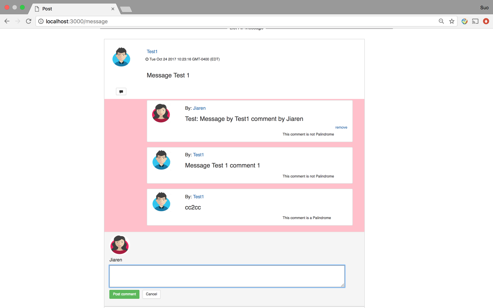
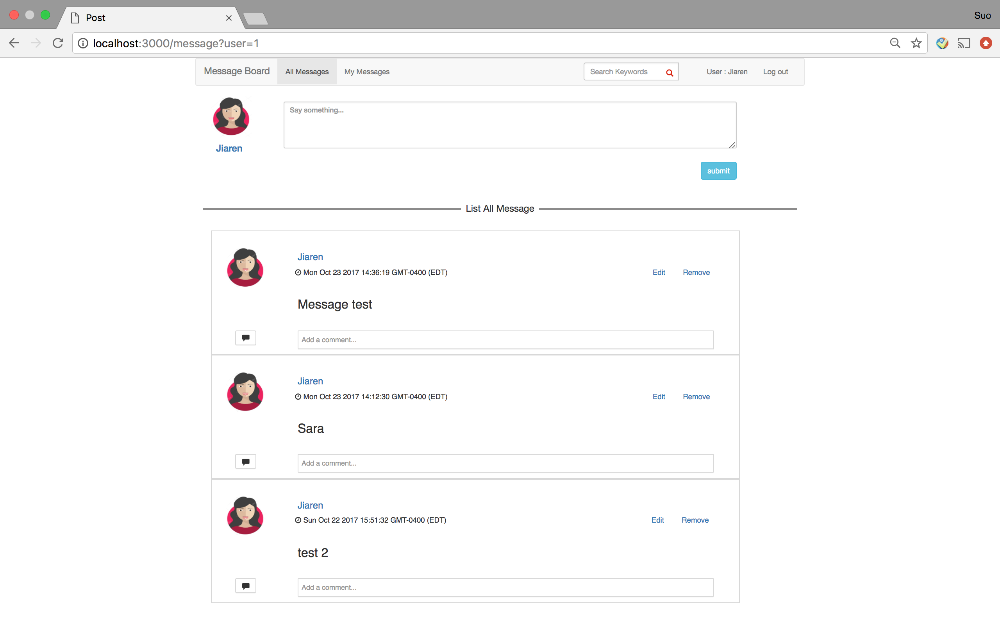

# Message-Board

## Description
MessageBoard is an application built with JQuery, Ajax, Node.js, Express.js and MySQL. It allows users to post messages and to comment on other messages that have been posted. 

## Features
- Post, edit and delete a message
- List received messages
- Search messages by author’s name or keywords
- Add, delete comments to specific message
- Check if a message is palindrome or not
- Add registration for new user
- Handle Login/Logout


## Prerequisites
- Node.js (download here: https://nodejs.org/en/)
- NPM (comes with recent versions of node)
- Express.js (will be installed with npm)
- MySQL (will be installed with npm)
- Express-session (will be installed with npm)
- EJS (will be installed with npm)
- Connect-flash (will be installed with npm)
- Cookie-parser (will be installed with npm)

## Install
- Step 1. Create database
You need to execute SQL script, Create the database scripts are in database.sql. 
- Step 2. System config
Edit  `db/db.js`
```
var  connection= mysql.createConnection({
   host:'localhost',
   user:'***',
   password:'***',
   database:'***',
   multipleStatements: true
 });
 ```
- Step 3. Start
If you want to start a system, executing the following command.
```
myapp/bin
node www
```
access application: http://localhost:3000 

## REST API Documentation
| Method  | URL |Description|
| ---- | ------------- |---------------------|
GET|`/`|homepage| 
|POST| `/addUser` |Add new user
 POST| `/login` |Log in 
GET|  `/log out` |Log out
POST| `/message` |Post a new message
 GET| `/message` |List all messages
GET|`/message?user=userId`|List personal messages
GET|`/message?search_content`|List all messages that contain keywords
GET|`/message/messageId`| Get a message by messageId
GET|`/message/:messageId/remove`|Remove a message by messageId
GET| `/message/:messageId/edit`|Edit a message by messageId
POST| `/message/:messageId/edit` |updaete a message
POST| `/message/:messageId/comment` |Create a comment
GET|  `/message/:messageId/comment/:commentId/remove`|Remove a comment
## Screenshot
### Homepage for Registration and Login

### Post and List Messages

### Leave a Comment to a Pecific Message and Check Palidrome  

### Show Personal Message

